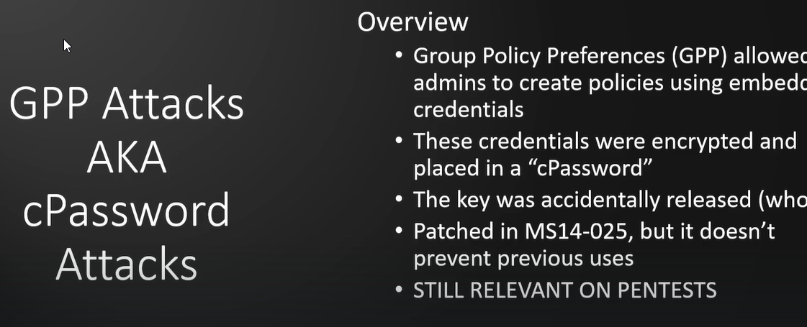
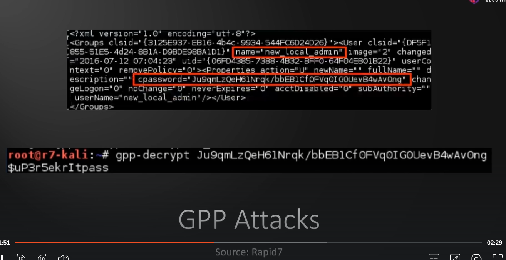
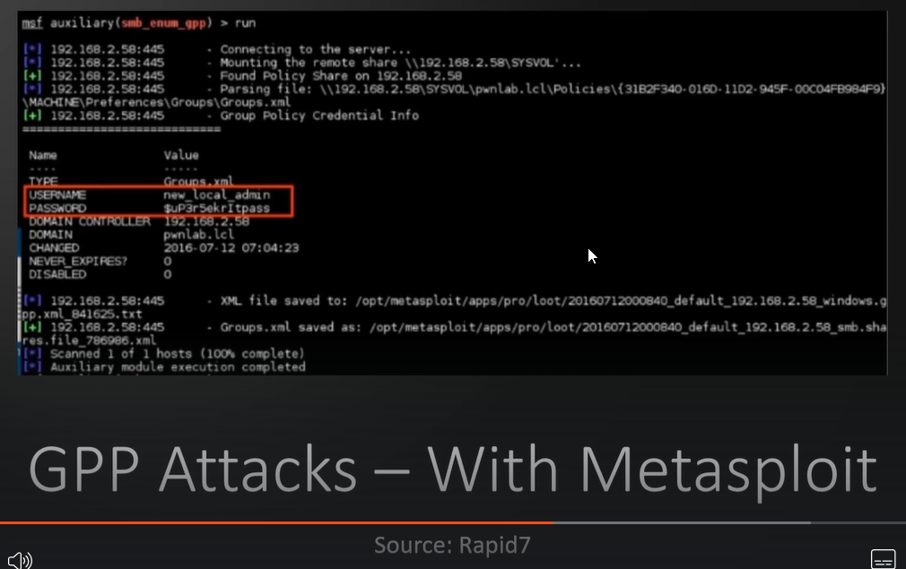
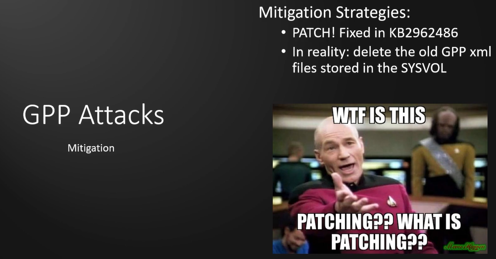

# GPP / cPassword Attacks and Mitigations

This is an older attack but there chances that it might just work 

Can do with metasploit as well
smb_enum_gpp

Mitigation

---
[Back to Attacking Active Directory: Post-Compromise Attacks ](./README.md)
