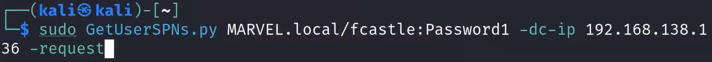
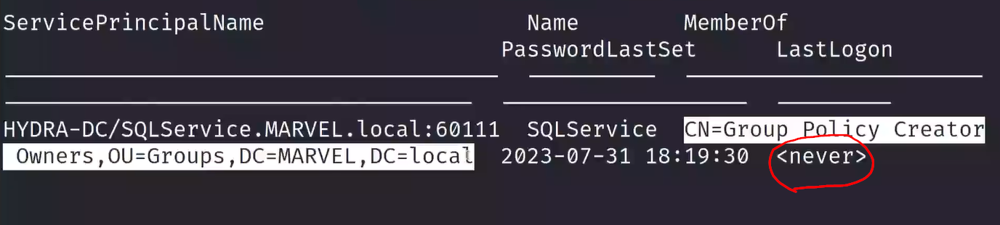

# Kerberoasting Walkthrough

To perform kerberos

When the last log in is never be careful it can be a honeypot account

Can crack the hash then which was generated

---
[Back to Attacking Active Directory: Post-Compromise Attacks ](./README.md)
