# 🛡️ Pass Attacks Overview

> **Course:** [Practical Ethical Hacking](../../README.md)  
> **Module:** [Attacking Active Directory: Post-Compromise Attacks ](./README.md)  
> **Navigation Path:** `Practical Ethical Hacking > Attacking Active Directory: Post-Compromise Attacks  > Pass Attacks Overview`

---

## 🎯 Executive Summary & Technical Objectives
This document details the practical methodology, tooling, exploitation chain, and defensive remediation for **Pass Attacks Overview** as conducted in the TCM Security lab environment.

---

## 🔬 Hands-On Walkthrough & Technical Evidence

we can use knwn passwords and hash to do lateral movement 

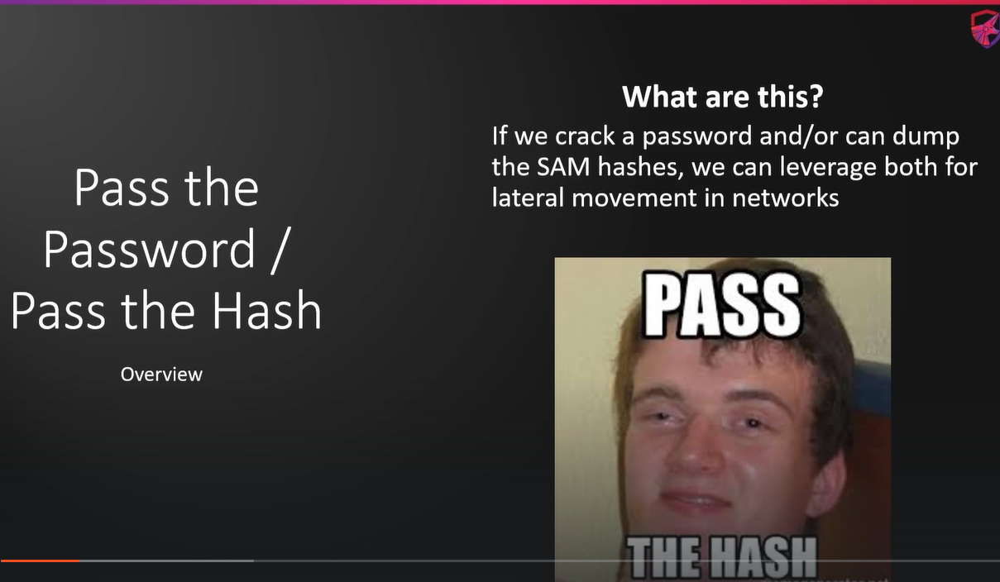
*Figure: Lab Execution Screenshot / Proof of Exploit*

We can use crackmapexec, It is used to password 
The passowed we might have captured from anywhere (responder, glabal hash etc)

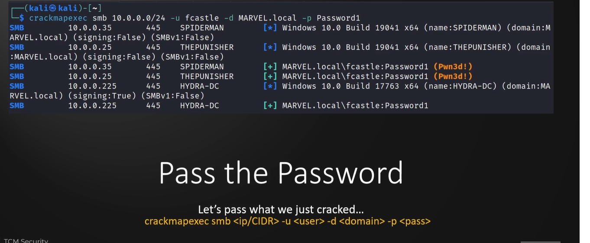
*Figure: Lab Execution Screenshot / Proof of Exploit*

can also do this  using hash which can get from metasploit 

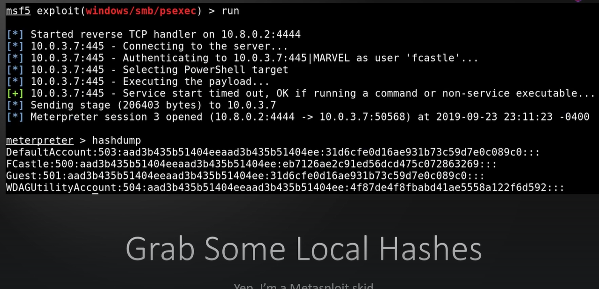
*Figure: Lab Execution Screenshot / Proof of Exploit*

or can use secretsdump (it can also c all the accounts tied up in the machine and domain)

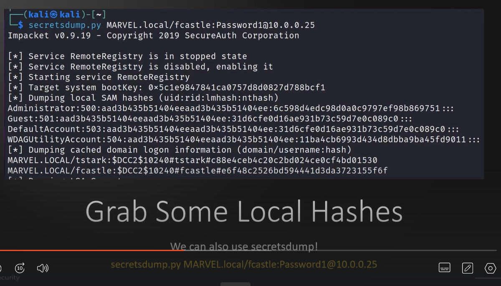
*Figure: Lab Execution Screenshot / Proof of Exploit*

this is how to pass the hash

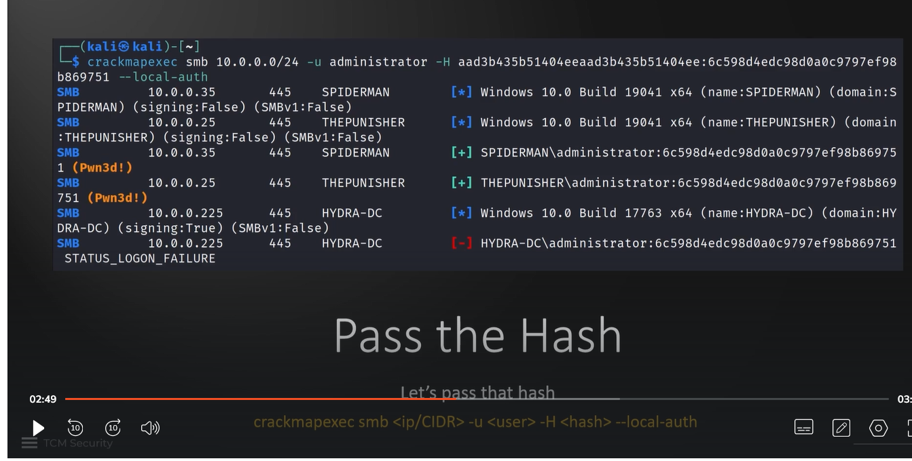
*Figure: Lab Execution Screenshot / Proof of Exploit*

we can do alot of things using crackmapexec
Like dumping the sam

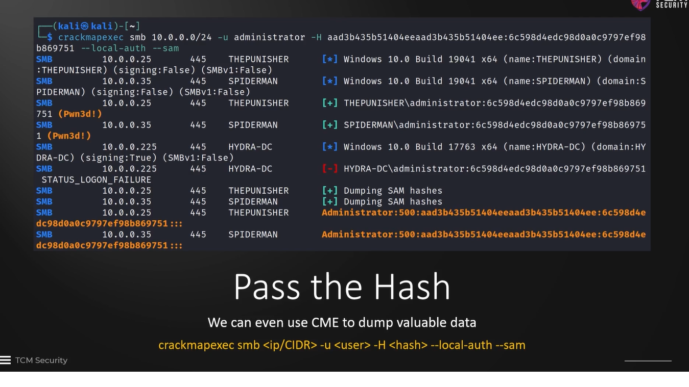
*Figure: Lab Execution Screenshot / Proof of Exploit*

can also enumerate shares

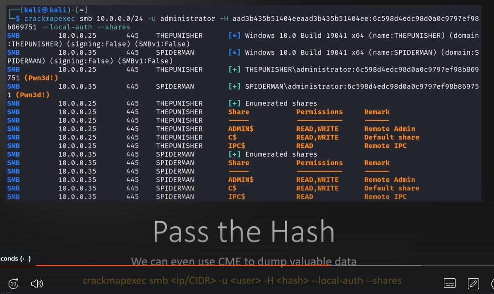
*Figure: Lab Execution Screenshot / Proof of Exploit*

also lsa (local security authority)

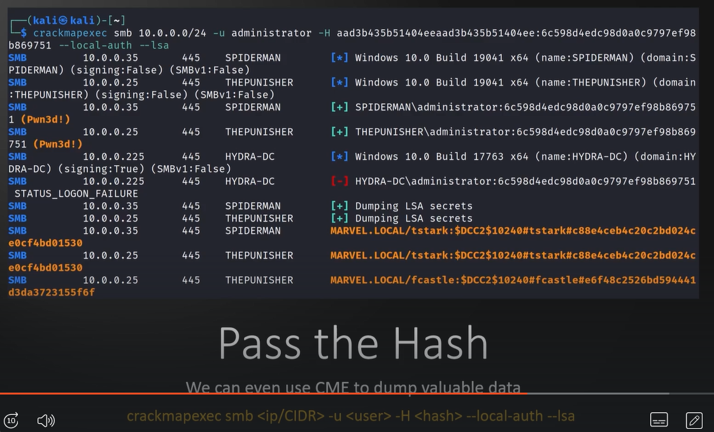
*Figure: Lab Execution Screenshot / Proof of Exploit*

It also has inbuilt modules

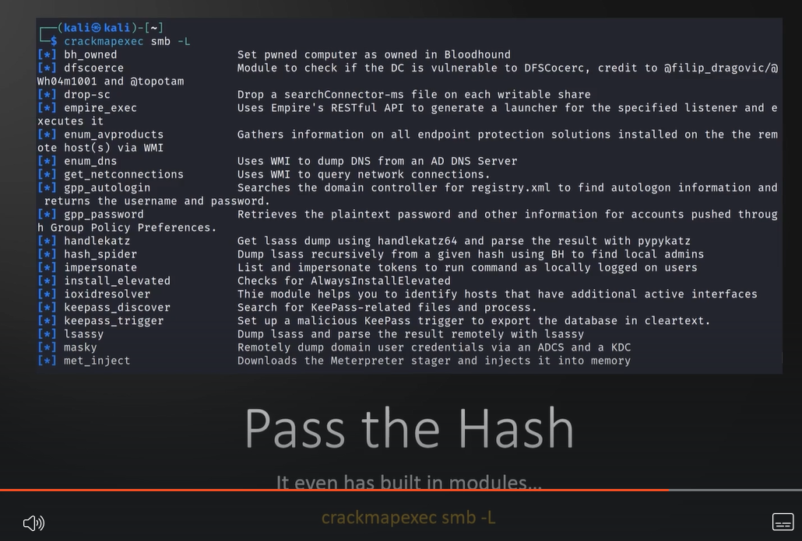
*Figure: Lab Execution Screenshot / Proof of Exploit*

lsassy one of the modules, can be used to dump out lsass (they enforce the security polices) and it also stores credentials. If there is active user login we may b able to dump out the credentials

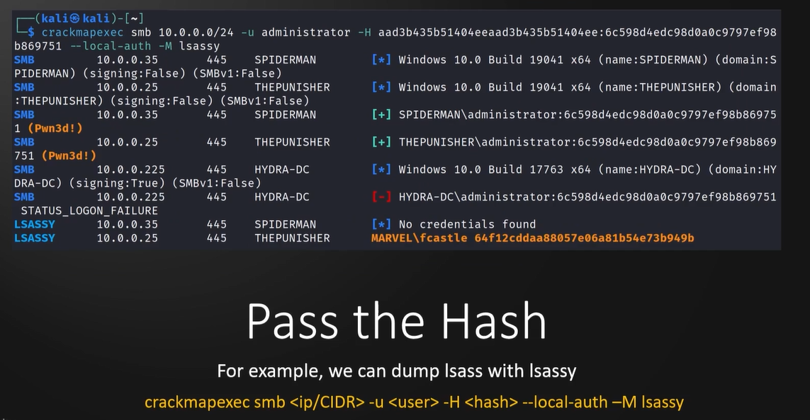
*Figure: Lab Execution Screenshot / Proof of Exploit*

It also has a database. it shows where all the users worked and wt passwords they have 

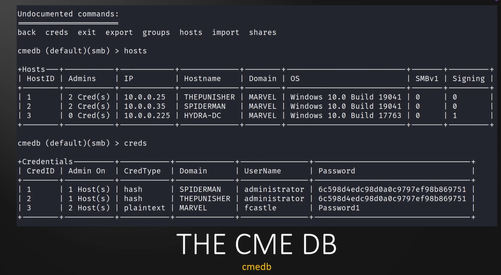
*Figure: Lab Execution Screenshot / Proof of Exploit*

---

## 🛡️ Defensive Hardening & Detection Signatures
- **Monitoring & Auditing:** Enable granular auditing for process creation (Windows Event ID 4688 / Sysmon Event 1) and network connections (Sysmon Event 3).
- **Least Privilege:** Enforce strict principle of least privilege across user accounts and service configurations.
- **Continuous Validation:** Conduct routine vulnerability scanning and automated configuration reviews to identify drift.

---
[⬅ Back to Attacking Active Directory: Post-Compromise Attacks ](./README.md) • [🏠 Master Course Index](../README.md)
