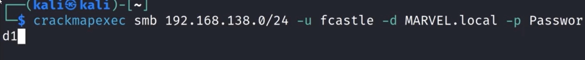
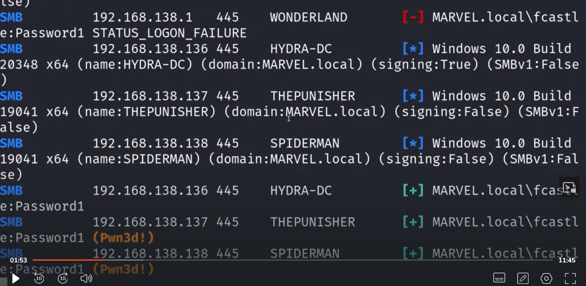
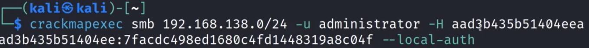
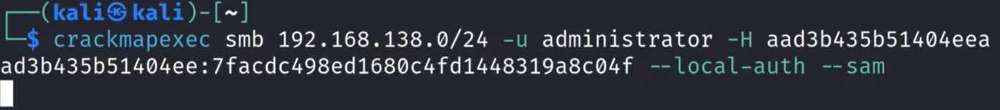
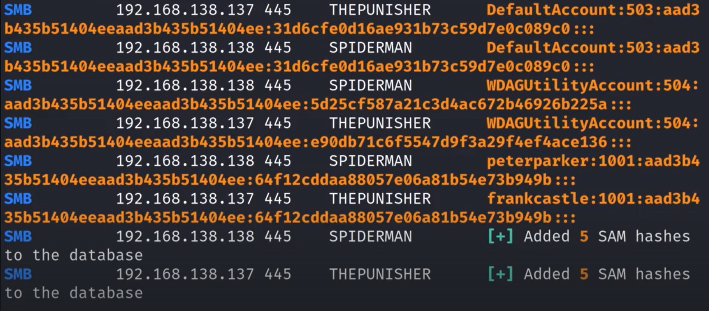
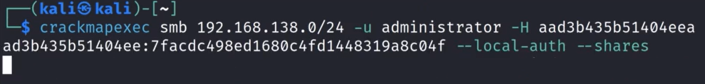
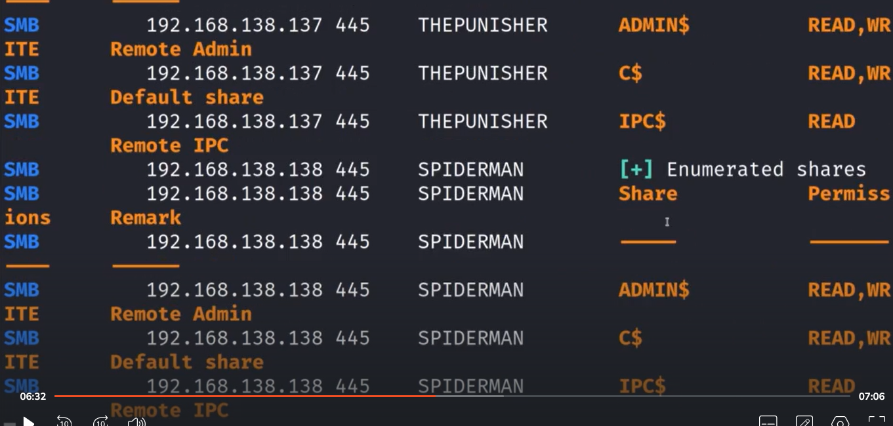
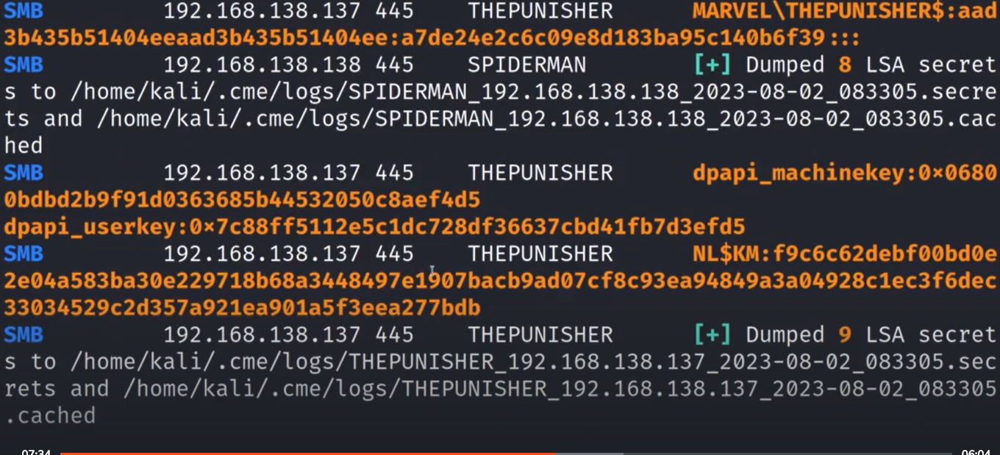
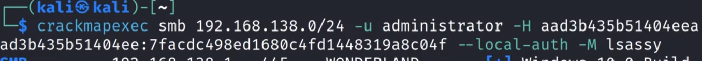
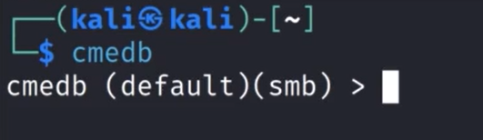

# Pass Attacks Walkthrough

Crackmapexec —help (to know more abt the protocols tha can be used in this thing)

It will attemp to log in on few machines which are part of the ip range/domain

In the above img we got log in into 2 machine which are THEPUNISHER and SPIDERMAN [+]
Successful Autentication happened in hydra-dc but we are not the local admin there [+]
WONDERLAND is an example of unsuccessful log in [-]

Now that we have access to the machine, the strategy would be to dump information such as hash etc using a tool like secretsdump 

We can do the same using a hash if we can not crack the hash

This can be done only with ntlmv1 and not with ntlmv2(ntlmv2 can be replayed)

can use —sam to dump information from security account manager

the data is stored in the database

We can do —shares to enumerate the shares and c to what we have access to

We can also look at —lsa it will dump out the local security authority

This information may or may not be usefull but it is better to check
Can attemp to crack the hashes which you get using this locally and then log in to the machine 

To use module type -M (module name)

It will dump out hashes if they were recently stored

Type cmedb to enter the crackmapexec database

type help to get more details

---
[Back to Attacking Active Directory: Post-Compromise Attacks ](./README.md)
