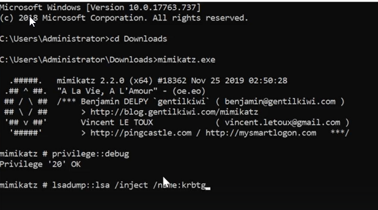
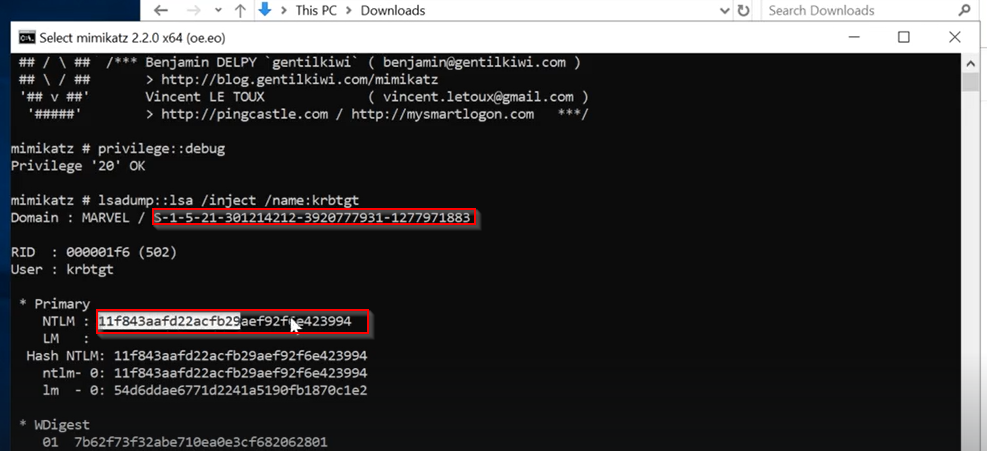
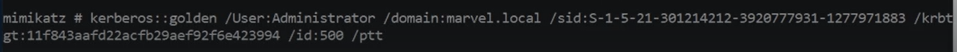
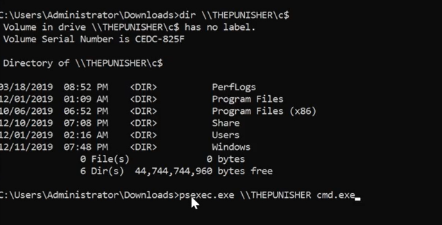

# 🛡️ Golden Ticket Attacks

> **Course:** [Practical Ethical Hacking](../../README.md)  
> **Module:** [We've Compromised the Domain - Now What? ](./README.md)  
> **Navigation Path:** `Practical Ethical Hacking > We've Compromised the Domain - Now What?  > Golden Ticket Attacks`

---

## 🎯 Executive Summary & Technical Objectives
This document details the practical methodology, tooling, exploitation chain, and defensive remediation for **Golden Ticket Attacks** as conducted in the TCM Security lab environment.

---

## 🔬 Hands-On Walkthrough & Technical Evidence

Having a golden ticket means we can hav access to all the files on the target

Start

*Figure: Lab Execution Screenshot / Proof of Exploit*

We need the s-id and  ntlm hash

*Figure: Lab Execution Screenshot / Proof of Exploit*

we can now generate the ticker

*Figure: Lab Execution Screenshot / Proof of Exploit*

The user can be any fake name 
ptt stands for pass the ticket 
id stands for the r id (admin acct of 500)

So we are going to generate the ticket the pass the ticket to the nxt/current session and then we wil use it to open a command promt and that will be able to acess any computer

can type the following to open command promt
misc :: cmd 

*Figure: Lab Execution Screenshot / Proof of Exploit*

can access any machine on the dc

use psexec to get shell (Home work)

---

## 🛡️ Defensive Hardening & Detection Signatures
- **Monitoring & Auditing:** Enable granular auditing for process creation (Windows Event ID 4688 / Sysmon Event 1) and network connections (Sysmon Event 3).
- **Least Privilege:** Enforce strict principle of least privilege across user accounts and service configurations.
- **Continuous Validation:** Conduct routine vulnerability scanning and automated configuration reviews to identify drift.

---
[⬅ Back to We've Compromised the Domain - Now What? ](./README.md) • [🏠 Master Course Index](../README.md)
