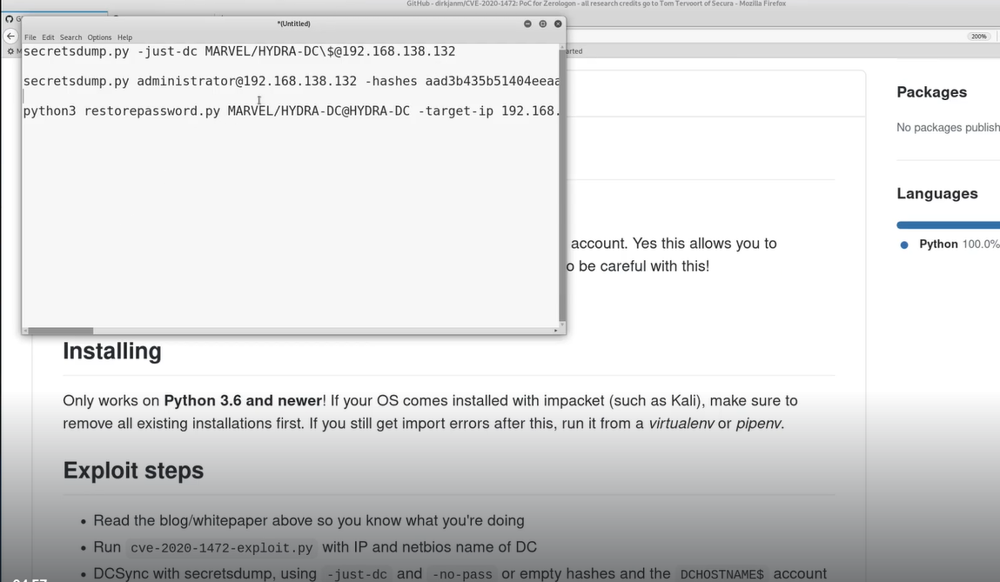
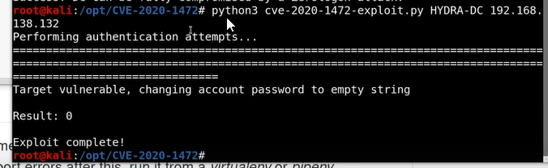
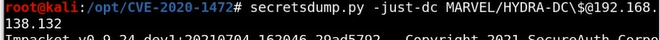
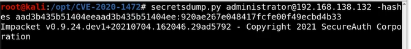
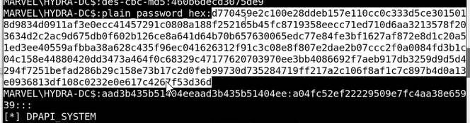
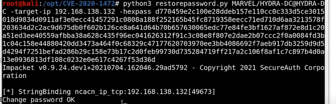

# 🛡️ Abusing ZeroLogon

> **Course:** [Practical Ethical Hacking](../../README.md)  
> **Module:** [Additional Active Directory Attacks](./README.md)  
> **Navigation Path:** `Practical Ethical Hacking > Additional Active Directory Attacks > Abusing ZeroLogon`

---

## 🎯 Executive Summary & Technical Objectives
This document details the practical methodology, tooling, exploitation chain, and defensive remediation for **Abusing ZeroLogon** as conducted in the TCM Security lab environment.

---

## 🔬 Hands-On Walkthrough & Technical Evidence

It is very very powerful and can destroy the domain
We can set the domain controller password to null , we have to restore the password also otherwise we will destroy the domain

What is ZeroLogon? - [https://www.trendmicro.com/en_us/what-is/zerologon.html](https://www.trendmicro.com/en_us/what-is/zerologon.html)
dirkjanm CVE-2020-1472 - [https://github.com/dirkjanm/CVE-2020-1472](https://github.com/dirkjanm/CVE-2020-1472)
SecuraBV ZeroLogon Checker - [https://github.com/SecuraBV/CVE-2020-1472](https://github.com/SecuraBV/CVE-2020-1472)

You can run the checker to see if the target is vulnerable and that is it
In a real pentest do not do anything further as it would probably wipe out the domain if udk wha tu are doin

Useuage is given

*Figure: Lab Execution Screenshot / Proof of Exploit*

Run the exploit

*Figure: Lab Execution Screenshot / Proof of Exploit*

Use secrets dump to dump out secrets of the machine

*Figure: Lab Execution Screenshot / Proof of Exploit*

The atk is done now

to restore
Take the administrator hash

*Figure: Lab Execution Screenshot / Proof of Exploit*

This is what we are goin to use to restore the dc

*Figure: Lab Execution Screenshot / Proof of Exploit*

*Figure: Lab Execution Screenshot / Proof of Exploit*

---

## 🛡️ Defensive Hardening & Detection Signatures
- **Monitoring & Auditing:** Enable granular auditing for process creation (Windows Event ID 4688 / Sysmon Event 1) and network connections (Sysmon Event 3).
- **Least Privilege:** Enforce strict principle of least privilege across user accounts and service configurations.
- **Continuous Validation:** Conduct routine vulnerability scanning and automated configuration reviews to identify drift.

---
[⬅ Back to Additional Active Directory Attacks](./README.md) • [🏠 Master Course Index](../README.md)
