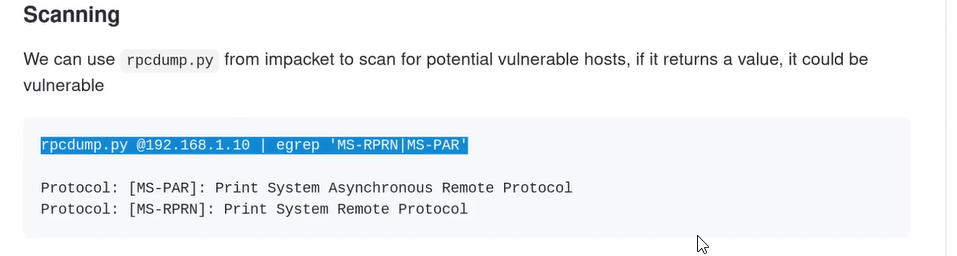
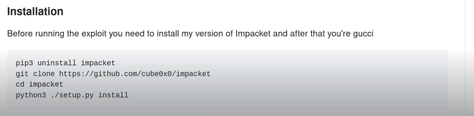
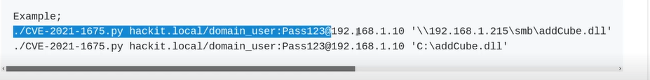
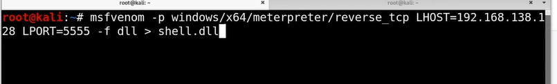
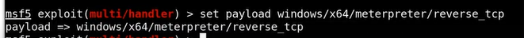
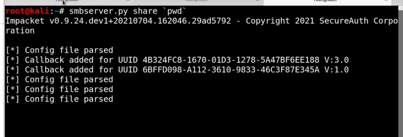
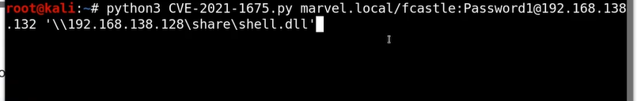

# PrintNightmare (CVE-2021-1675) Walkthrough

cube0x0 RCE - [https://github.com/cube0x0/CVE-2021-1675](https://github.com/cube0x0/CVE-2021-1675)
calebstewart LPE - [https://github.com/calebstewart/CVE-2021-1675](https://github.com/calebstewart/CVE-2021-1675) (This is by that youtuber john hamod or someone)

One of the powerfull attacks of 2021

Requires no authentication outisde of user account

This attack takes advantage of the printer schooler bacically it allows the users to add printers and things like that runs as system privilage 

This is kinda similar to prince uter but at a more severe level

We will focus on this cube0x0 RCE - [https://github.com/cube0x0/CVE-2021-1675](https://github.com/cube0x0/CVE-2021-1675)

To check if the machine is vulnerable to this attack

Now for installation

So what we are goin to do is 

Run this line of code with a malacious dll 

We use msfvenom to make a payload

Whenever we do msfvenom we hav to do msfvconsole
Then we are goin to get a meterpreter session

use multi/handler

set payload

set lhost and lport

Now the other thing we need to do is create a file share

We are basically sharing the whole directory above

To run the exploit

If you get any issues go to github in the issues tab and check there

Sometime the microsoft defender will become on the dll and block the attack
Need to obsequate the dll a little of av bypassing 

---
[Back to Additional Active Directory Attacks](./README.md)
