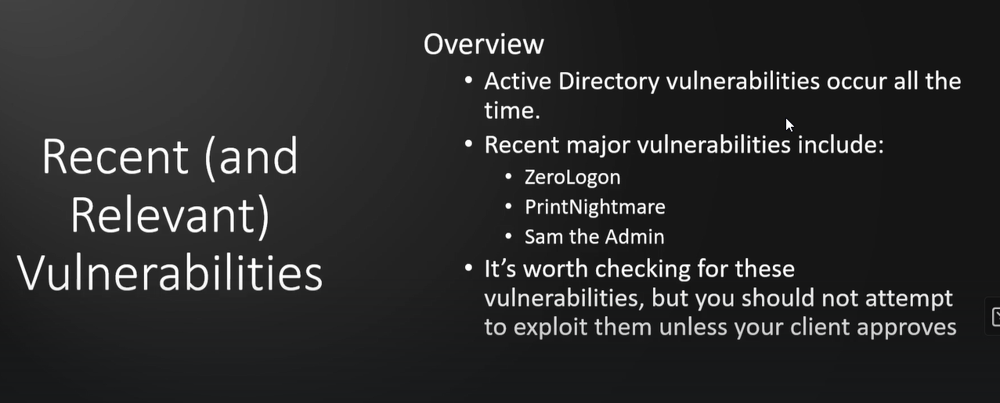

# Section Overview

There are some type of attacks which will completly wipe out the domain so be carefull with what you aree attacking with so that you know what it can do

For eg the zerologon can destroy the entire domain completly if not done by following the proper steps

---
[Back to Additional Active Directory Attacks](./README.md)
