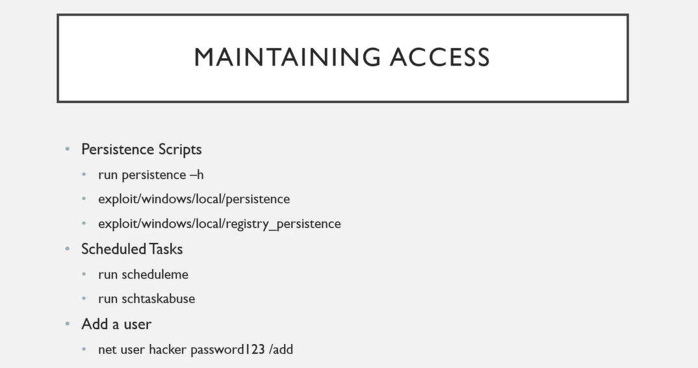

# 🛡️ Maintaining access

> **Course:** [Practical Ethical Hacking](../../README.md)  
> **Module:** [Post exploitation ](./README.md)  
> **Navigation Path:** `Practical Ethical Hacking > Post exploitation  > Maintaining access`

---

## 🎯 Executive Summary & Technical Objectives
This document details the practical methodology, tooling, exploitation chain, and defensive remediation for **Maintaining access** as conducted in the TCM Security lab environment.

---

## 🔬 Hands-On Walkthrough & Technical Evidence

If something happens to the machine we should still be able to maintain access

*Figure: Lab Execution Screenshot / Proof of Exploit*

As a pentester most of the times we will use the add a user to maintain access

Using run persistence -h or any persistence scripts is a bit dangerous since we are opening a port to the machine without autentication

The scheduled tasks, basically wt happens is u hav malware on the computer and this task will check often if the comp get rebooted it will run and u still will maintain access to the machine 
This usually falls in the red teaming line 

---

## 🛡️ Defensive Hardening & Detection Signatures
- **Monitoring & Auditing:** Enable granular auditing for process creation (Windows Event ID 4688 / Sysmon Event 1) and network connections (Sysmon Event 3).
- **Least Privilege:** Enforce strict principle of least privilege across user accounts and service configurations.
- **Continuous Validation:** Conduct routine vulnerability scanning and automated configuration reviews to identify drift.

---
[⬅ Back to Post exploitation ](./README.md) • [🏠 Master Course Index](../README.md)
