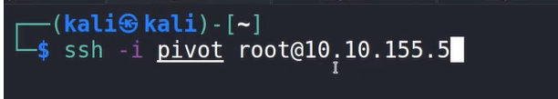
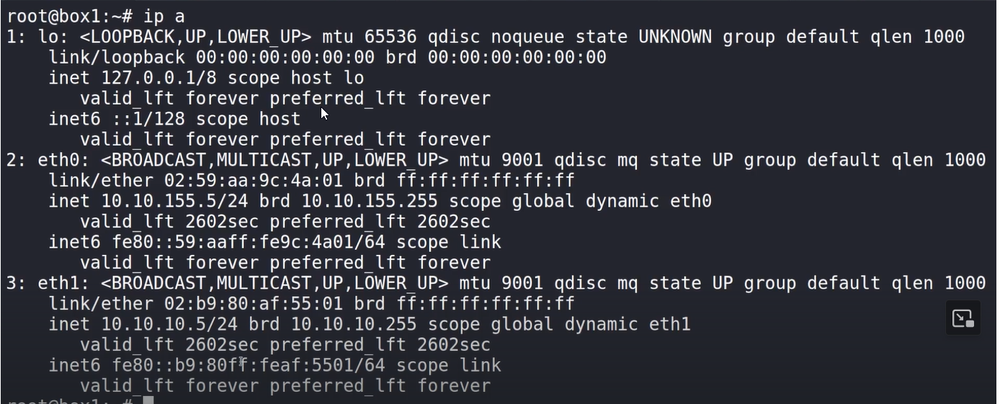

# Overview

say you are on one network with a compremised machine and from that machine you discover a different ip range, but you cannot ping that range since you do not have path to it. Now to ping/access that machine we will need to set up a proxy from the already compremised machine 

The compremised machine

Discovered another ip set

---
[Back to Post exploitation ](./README.md)
