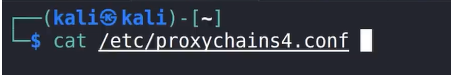
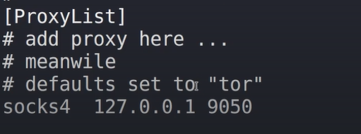
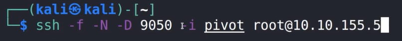
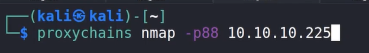
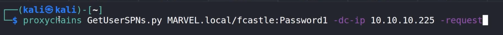
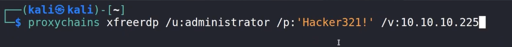
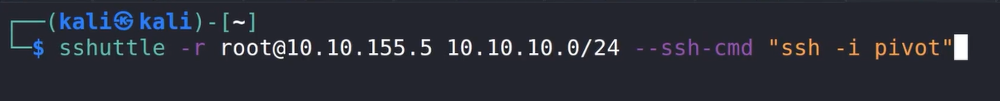
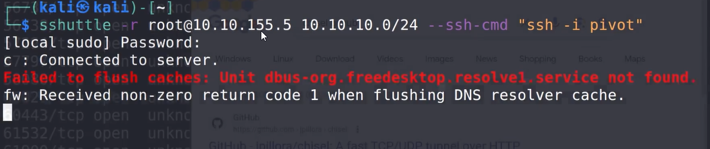
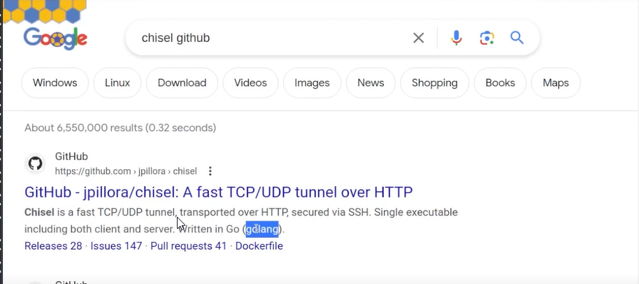

# Walkthrough

proxychains
First we will configure it

At the very botton we wil c

So will use the 9050 port to bind this port

-f will just background the ssh
-N is grt for forwarding ports
-D to specify where we will bind the port

After executing the above command we can proxy through that machine 

We can run nmap through the proxy, n now we can scan the  ip which we could not previously

-p88 id used since it is a domain controller and kerberos is there on 88
We can even scan the whole network
Can do -sT tcp connect scan if ntg showing up

We can also run attacks through proxychains

Atking with kerbaroasting

More things which we can do are as follows

To rdp in the domain controller

we can also open firefox
proxychains firefox 

Using sshuttle

With the use of sshuttle we do not need to type proxychain in front of alll the commands 
all r traffic will go through the proxy as long as the connection is established

Do not worry abt that error

Another tool which you can use for pivoting is 

---
[Back to Post exploitation ](./README.md)
