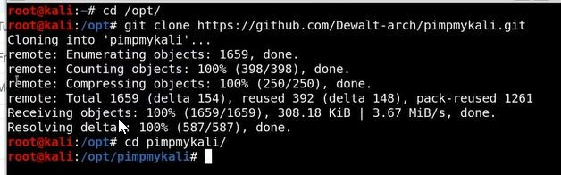
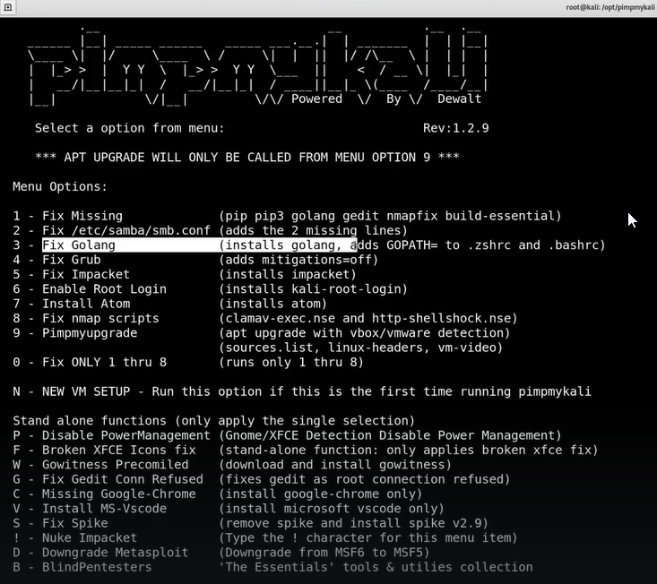

# 📁 Web Application Enumeration

> **Curriculum:** TCM Security — Practical Ethical Hacking (PEH)  
> **Module Description:** Subdomain discovery (Assetfinder, Amass), alive domain filtering (Httprobe), visual recon (GoWitness), and automated bash pipelines.

---

## 🎯 Module Overview & Learning Outcomes
This module provides practical, hands-on methodology and field-tested offensive techniques for **Web Application Enumeration**. 

### 🛠️ Key Tools & Technologies Used
- Specialized exploitation, scanning, and enumeration toolkits.
- Command-line syntax, packet captures, and proof-of-concept demonstrations.
- Defensive detection signatures and hardening strategies.

---

## 📂 Module Topics & Lab Walkthroughs

- 📑 **[Additional resources](./Additional_resources.md)**
- 📑 **[Amass](./Amass.md)**
- 📑 **[Assetfinder](./Assetfinder.md)**
- 📑 **[Automating the Enumeration Process](./Automating_the_Enumeration_Process.md)**
- 📑 **[Finding Alive Domains with Httprobe](./Finding_Alive_Domains_with_Httprobe.md)**
- 📑 **[Finding Subdomains](./Finding_Subdomains.md)**
- 📑 **[Screenshotting Websites with GoWitness](./Screenshotting_Websites_with_GoWitness.md)**

---

## 📝 Core Module Documentation & Notes

Install Go
use pimpmykali(search on github) to install go

*Figure: Lab Execution Screenshot / Proof of Exploit*

*Figure: Lab Execution Screenshot / Proof of Exploit*

- 📄 **[Finding Subdomains](./Finding_Subdomains.md)**- 📄 **[Finding Alive Domains with Httprobe](./Finding_Alive_Domains_with_Httprobe.md)**- 📄 **[Screenshotting Websites with GoWitness](./Screenshotting_Websites_with_GoWitness.md)**- 📄 **[Automating the Enumeration Process](./Automating_the_Enumeration_Process.md)**- 📄 **[Additional resources](./Additional_resources.md)**

---
[⬅ Back to Master Course Index](../README.md)
