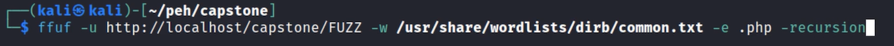
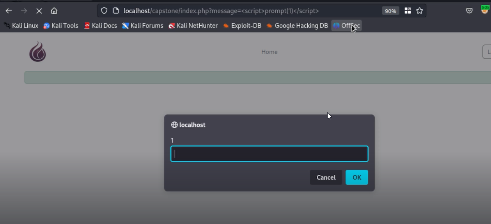
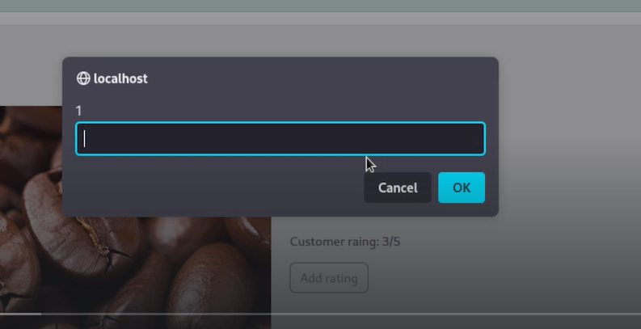
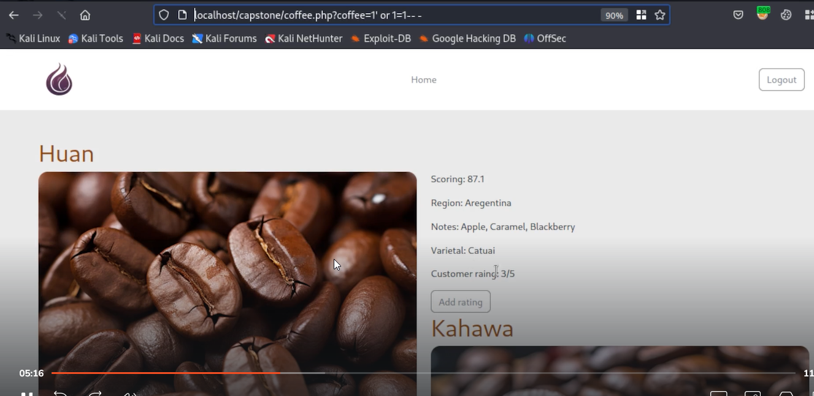

# Actual walkthrough

Enumeration

After logging in when you get message can edit that on top in url
This led to us being able to do xss

Did the same in review 
This is a stored xss which is way more dangerous

Found an entry point for sql injection in url

Found username and hashes of password from here

Used hashcat to crack the password

---
[Back to Common Web Vulnerabilities](./README.md)
