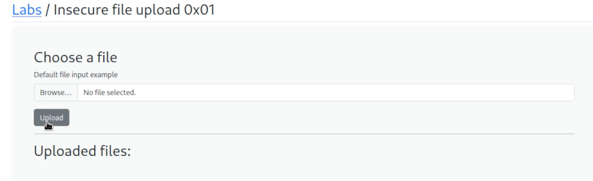
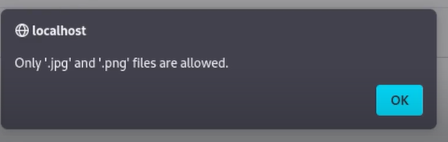
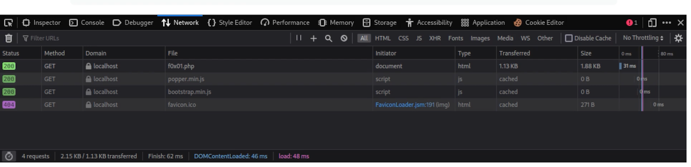
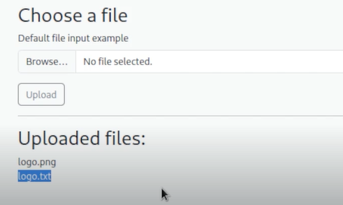
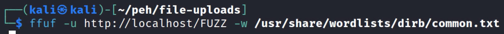
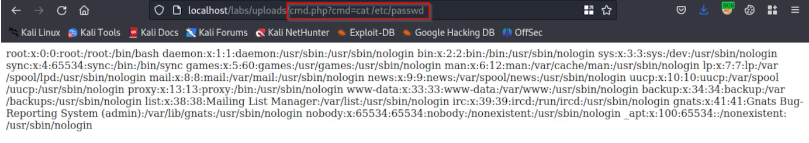

# Basic Bypass - Lab 1


basic funtionality: We have to upload and it will show which file are uploaded



Tried to upload a text file but got an error



Opened dev tools and went to the network section
Tired to upload the text file again, but this time looking for system calls on the web server
No checks were found


This means the check is happening on the client side
We have full control over the client side 
We can just disable JS and the check will not happen OR we can intercept the request and change the file

In this we going to intercept using burp
We upload a img while the burp proxy is on and then send the req to the repeater
Get rid of the img data
Put a simple text 
Change the file name to txt
We got the response that the txt file was uploaded and it reflected on the site as well


There maybe blocklists that might block php files so its always better to do more testing

We then craft our payload

```php
<?php system($_GET['cmd']); ?>
```
- system(): This function executes an external program and displays the output.- $_GET['cmd']: This retrieves the value of the cmd parameter from the URL query string.Security Implications
This code allows an attacker to execute arbitrary system commands by passing them as a query parameter. For example:

```bash
http://example.com/vulnerable.php?cmd=ls
```

Change the file name to an executable
In this changed it to cmd.php 
(.php for executable)

Now we hav to find out where the file is 
We used ffuf to search for directories


Found the location and did RCE



Have been told to upload or find a reverse shell on own for fun


---
[Back to Common Web Vulnerabilities](./README.md)
