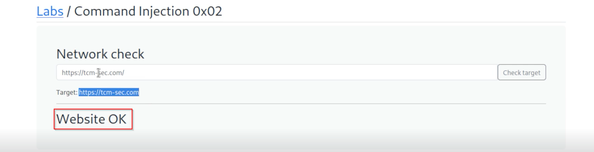
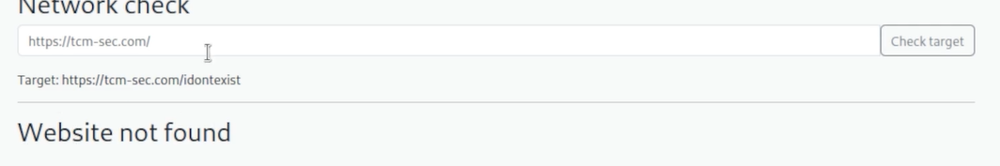
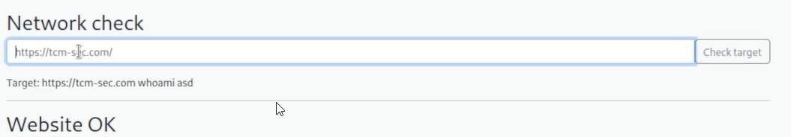
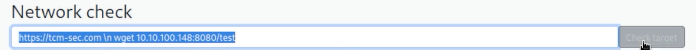
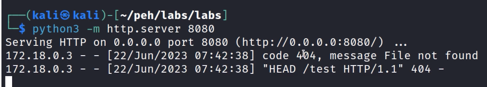
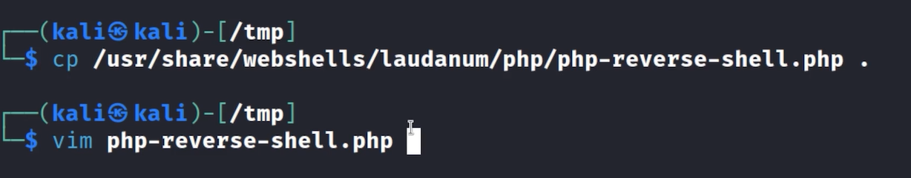
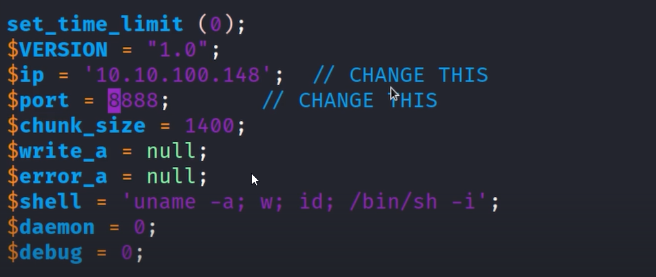
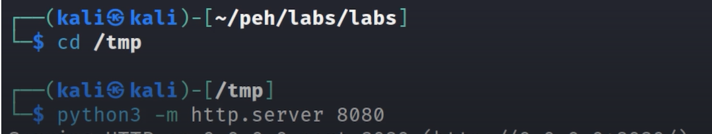
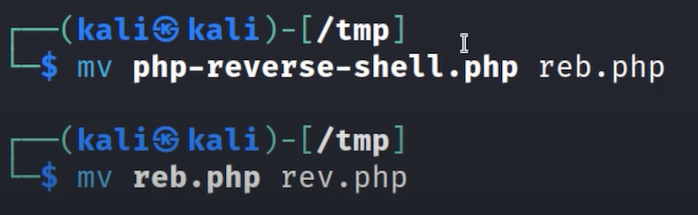
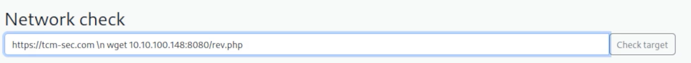

# Blind / Out-of-Band - Lab 2



The Search is reflected back in the target
We do not get any more response from the web pg, the Website OK is a status 200



If we enter any bs then we get Website not found 


```bash
tcm-sec.com; whoami; asd
```
we get Website Found on this


If notice carefully can see that the ‘ ; ‘ is missing in the target even though we searched for it
so what is happening is it is filtering out the semi colons 

To get the proper response of this we will have to set up a webserver (can use netcat or webhooks.site, just do not use webhooks in an actual bug bounty or pentest because we do not wnt to leak data)

Then can try to insert a command with “backticks”

```bash
?'whoami'
```

Can use the following to make request to ourself
Goal of this was to check if can get another line of code execution with \n


Set a python server


Since we know that the semi colon is getting filtered we will avoid using payloads with php

In this case we will try to upload a shell and trigger it

So ya, do this



then well, do this 



open the python webserver in tmp folder since the file is there



Rename file (Not important but he normally uses this)


Set up http server with pyhton in this

Then final step



This method which was shown above may not work anymore 

{ interrupt
New method


 interrupt over }

We can now set up a listener on netcat
And open the rev.php on localhost
we should get the shell


---
[Back to Common Web Vulnerabilities](./README.md)
