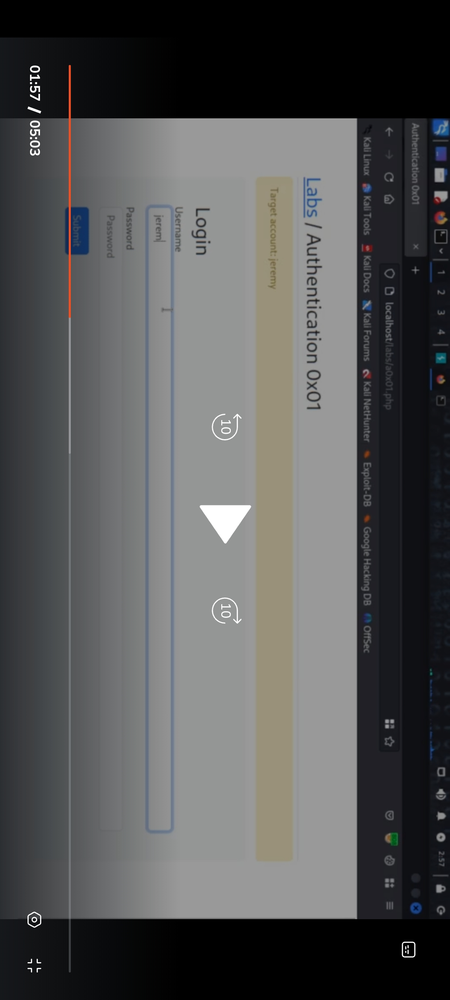

# Brute force - Lab 1

It might seem easy but may take long time if not done correctly

We need to have resonably sized lists 
we have to be aware that the accounts may get blocked or our ip might get blocked
Always say inside of  restiction  like bug bounty programme specification(automated tools : 5 / sec)

Don't underestimate brute forcing it can be very useful

This is a basic log in page which we are given 
We can do brute forcing from a variety of ways on this 
For now we wil intercept the request we sent to log and attack with burp
We choose the xeno top 100 request from seclist 

We then try the same attack with ffuf
We copy the request from burp and then put the keyword FUZZ 
Use the same word list
Use —request proto http
After that 
We use the fs filter to filter by size to find the other response 

---
[Back to Common Web Vulnerabilities](./README.md)
