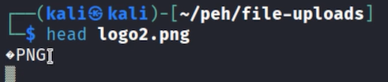
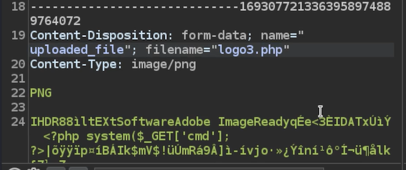
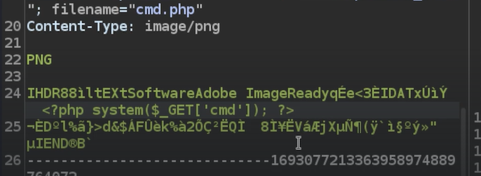
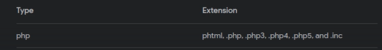

# Magic Bytes - Lab 2


We ran the same things as lab well
But it did not work because here the checks are happening server side 


```bash
filename="eg.php"
```
This could not be uploaded since the server side is accepting only png or jpg in its checks

some ways to bypass this

```bash
filename="eg.php.png"  #If the htaccess file is not configured properly this will be accepted, beacuse it will try and regex .php without including .png
filename="eg.php." #extra . before png may help in some old cases
filename="eg..php" #extra . before png may help in some old cases
filename="eg.php%00.png" #null bite discards the .png wil work in some old machine
```
Another way we can use is try to upload a special htaccess file that will let us execute .asd as .php

Another thing to check if the response is 
magic bytes : they are the first few bites of the file which tell the machine what type of file it is 
Eg.


The above is the magic byte for a png file

So we did the following


We added the payload in the png file data
And then changed the filename to .php to execute
We were still getting some error when we tried to do RCE through the url
so we edited a bit


We cut most the middle data of the png file

And it worked

Tips: If there is website which has a blocklist in place for .php
We can try other php extensions with the same php payload
Go the image for google



We also upload special files which will trick the web server in to using a custom file extension for execution


---
[Back to Common Web Vulnerabilities](./README.md)
