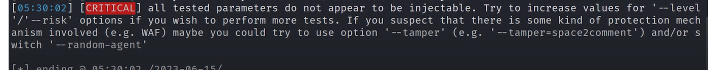
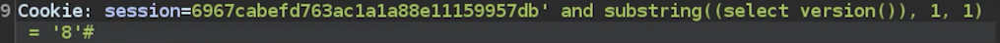
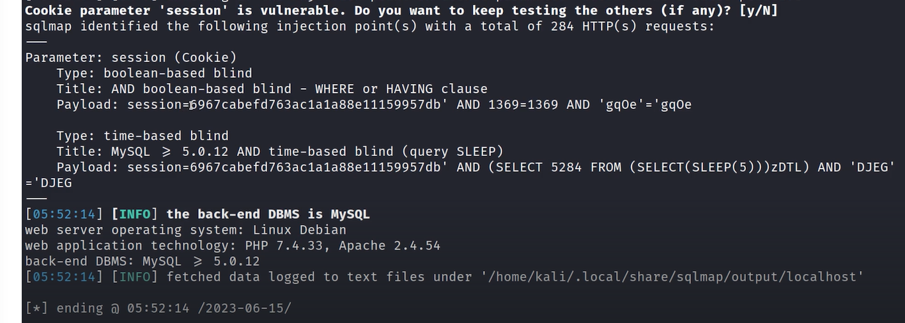
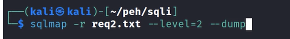

# 🛡️ SQL injection blind Lab 2

> **Course:** [Practical Ethical Hacking](../../README.md)  
> **Module:** [Common Web Vulnerabilities](./README.md)  
> **Navigation Path:** `Practical Ethical Hacking > Common Web Vulnerabilities > SQL injection blind Lab 2`

---

## 🎯 Executive Summary & Technical Objectives
This document details the practical methodology, tooling, exploitation chain, and defensive remediation for **SQL injection blind Lab 2** as conducted in the TCM Security lab environment.

---

## 🔬 Hands-On Walkthrough & Technical Evidence

Gonna use burp
Add the site in scope so we do not get unnecesary traffic

One of the main things to pay attention to is the content length of the response

We will copy the request from burp and pastse it in a file

then use sqlmap -r filename
It will tell you if the target is injectable or not 

*Figure: Lab Execution Screenshot / Proof of Exploit*

Since the sqlmap is saying parameters do not appear to be injectable, we can still go and try manually or download a list of payloads and try to fuzz it
Or we can look for other injection points 

We can also try the injection on the cookie if the web pg is somehow processing it 

This is a blind injection as it will only change the behaviour of the application

Blind injection to check the version mysql

*Figure: Lab Execution Screenshot / Proof of Exploit*

We need to put the select versiom() in brackets because we need it to resolve  first 

can send to intruder and use sniper to brute force long things like passowrds

Or we can copy the request and put it through the sqlmap
use —level=2 to pass the cokie(it may change overtime so google and c the correct syntax )

We can use this in our report 

*Figure: Lab Execution Screenshot / Proof of Exploit*

We can use the following command to dump the whole database

*Figure: Lab Execution Screenshot / Proof of Exploit*

Do not fire off sql map if the bug bounty programme says 5 req per second or smthng

---

## 🛡️ Defensive Hardening & Detection Signatures
- **Monitoring & Auditing:** Enable granular auditing for process creation (Windows Event ID 4688 / Sysmon Event 1) and network connections (Sysmon Event 3).
- **Least Privilege:** Enforce strict principle of least privilege across user accounts and service configurations.
- **Continuous Validation:** Conduct routine vulnerability scanning and automated configuration reviews to identify drift.

---
[⬅ Back to Common Web Vulnerabilities](./README.md) • [🏠 Master Course Index](../README.md)
