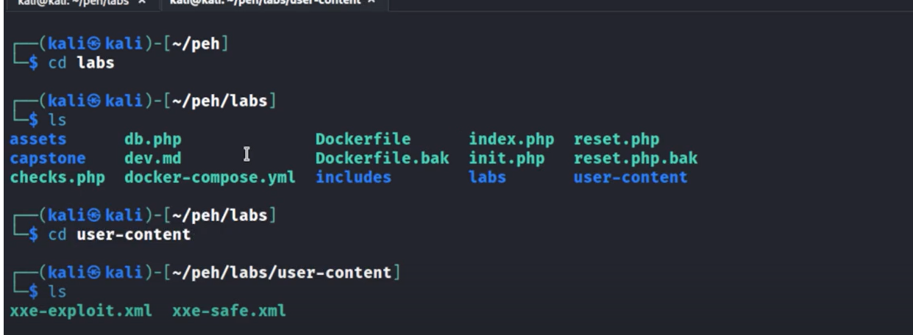

# XXE - External Entities Injection

Some websites use XML to transfer data we can use the XXE attack 

XML entity is a simple way of representing data for special characters
For eg & < >  we hav amp lt and gt respectively 

An enternal entity is a custom entity whose defination is outside the document and therefore needs to be located as the xml is passed
By abusing the above we can:
We can read files as well as get some remote execution with this attack 

For this there is already files which are there in the file we extracted the course from

Can find other exploit for remote code execution in payloadforall things github

This is not smthing we find often but it is good to test for if you see the target accepting xml

Also sending xml data through api endpoints which accepts JSONs, as sometimes they will also accept xml and then after further testing can find out that the endpoint is vulnerable

---
[Back to Common Web Vulnerabilities](./README.md)
