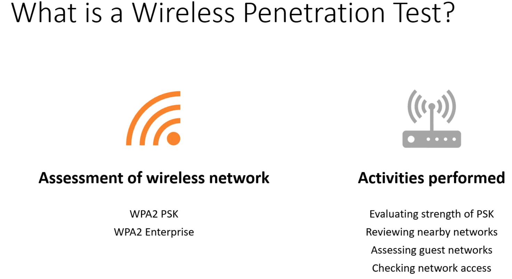
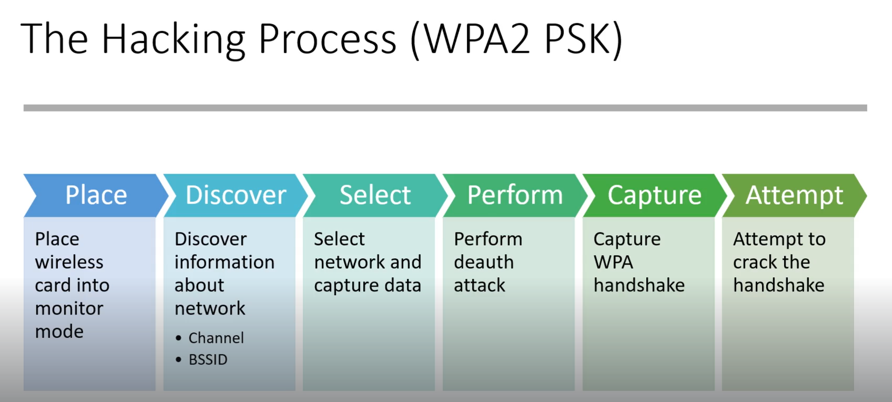

# 📁 Wireless Penetration Testing

> **Curriculum:** TCM Security — Practical Ethical Hacking (PEH)  
> **Module Description:** 802.11 monitor mode, Airmon-ng, Airodump-ng, Aireplay-ng deauth attack, and WPA/WPA2 4-way handshake capture & cracking.

---

## 🎯 Module Overview & Learning Outcomes
This module provides practical, hands-on methodology and field-tested offensive techniques for **Wireless Penetration Testing**. 

### 🛠️ Key Tools & Technologies Used
- Specialized exploitation, scanning, and enumeration toolkits.
- Command-line syntax, packet captures, and proof-of-concept demonstrations.
- Defensive detection signatures and hardening strategies.

---

## 📂 Module Topics & Lab Walkthroughs

- 📑 **[WPA_PS2_Exploit_Walkthrough](./WPA_PS2_Exploit_Walkthrough.md)**

---

## 📝 Core Module Documentation & Notes

*Figure: Lab Execution Screenshot / Proof of Exploit*

*Figure: Lab Execution Screenshot / Proof of Exploit*

ssid will be given by client

- 📄 **[WPA_PS2_Exploit_Walkthrough](./WPA_PS2_Exploit_Walkthrough.md)**

---
[⬅ Back to Master Course Index](../README.md)
