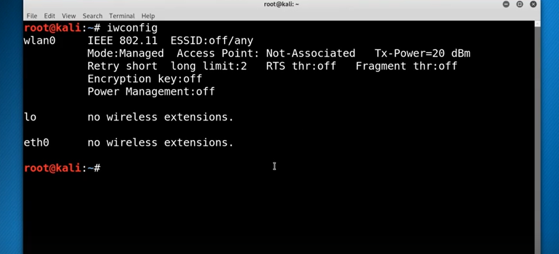
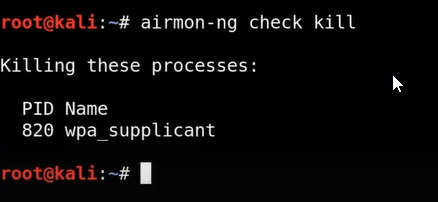
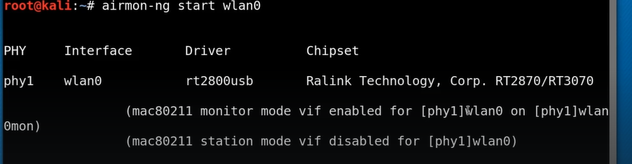
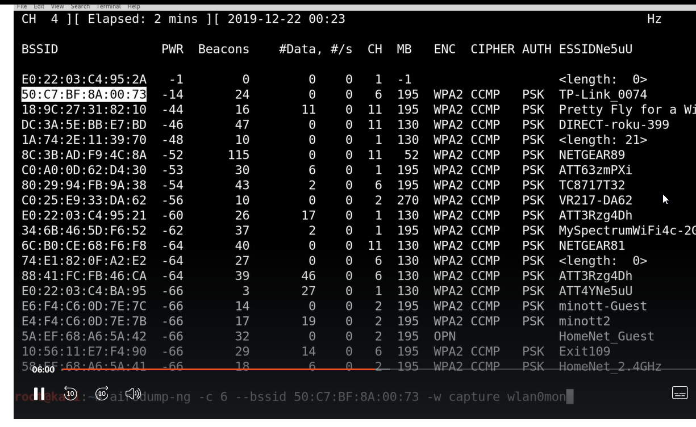
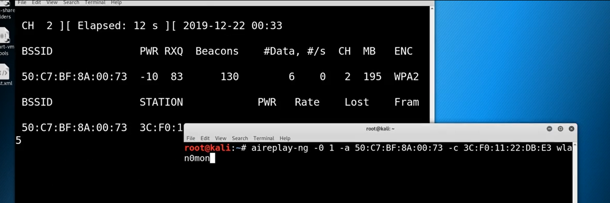

# WPA_PS2_Exploit_Walkthrough

iwconfig is the same as ifconfig but for wireless



To start our attack we need to place the card in monitor mode 





```bash
airmon-ng check kill
```
it will the processes which will interfere when we are attacking

To start monitor mode



To see all the devices around


Get the following output


Can type the code above to narrow it down and then save it to a file -w filename

It will take time to successfuly complete the attack 
We can speed things up by doing an deauth attack
Basically we going to kick someone of the wireless network
And then what happen is when the client re initiates that handshake is passed out





---
[Back to Wireless Penetration Testing](./README.md)
