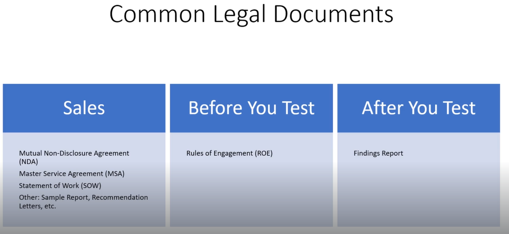

# 🛡️ Common_Legal_Documents

> **Course:** [Practical Ethical Hacking](../../README.md)  
> **Module:** [Legal Documents and Report Writing ](./README.md)  
> **Navigation Path:** `Practical Ethical Hacking > Legal Documents and Report Writing  > Common_Legal_Documents`

---

## 🎯 Executive Summary & Technical Objectives
This document details the practical methodology, tooling, exploitation chain, and defensive remediation for **Common_Legal_Documents** as conducted in the TCM Security lab environment.

---

## 🔬 Hands-On Walkthrough & Technical Evidence

*Figure: Lab Execution Screenshot / Proof of Exploit*

---

## 🛡️ Defensive Hardening & Detection Signatures
- **Monitoring & Auditing:** Enable granular auditing for process creation (Windows Event ID 4688 / Sysmon Event 1) and network connections (Sysmon Event 3).
- **Least Privilege:** Enforce strict principle of least privilege across user accounts and service configurations.
- **Continuous Validation:** Conduct routine vulnerability scanning and automated configuration reviews to identify drift.

---
[⬅ Back to Legal Documents and Report Writing ](./README.md) • [🏠 Master Course Index](../README.md)
