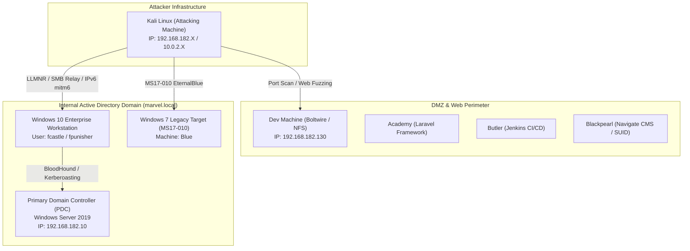

# 🛡️ Practical Ethical Hacking (PEH)
## Comprehensive Penetration Testing Portfolio & Technical Proof of Work

---

## 📜 Executive Summary & Author Proof Statement

This repository contains the complete, end-to-end technical documentation, attack methodologies, lab proofs, and capstone assessments completed as part of **TCM Security's Practical Ethical Hacking (PEH)** curriculum.

The documentation is organized to demonstrate rigorous technical competency across:
1. **Network Reconnaissance & Vulnerability Assessment**
2. **Web Application Penetration Testing (OWASP Top 10)**
3. **Active Directory Enterprise Exploitation & Privilege Escalation**
4. **Post-Exploitation, Lateral Movement & Pivoting**
5. **Wireless Penetration Testing (WPA/WPA2)**
6. **Professional Pentest Reporting, Scoping & Legal Frameworks**

> [!IMPORTANT]
> **Proof of Practical Competency:**  
> All 21 modules, hands-on lab exercises, and 5 standalone capstone machines (**Blue**, **Academy**, **Dev**, **Butler**, **Blackpearl**) were solved and documented with exact command rationale, terminal outputs, root-cause vulnerability analyses (CVE/CWE), and defensive remediation steps.

---

## 🏗️ Virtual Attack Lab Topology

The following diagram illustrates the simulated enterprise testbed utilized throughout this coursework:

---

## 🎯 MITRE ATT&CK® Enterprise Mapping

| MITRE ATT&CK Tactic | Technique ID | Technique Name | Demonstrated In Module |
|---|---|---|---|
| **Reconnaissance** | `T1595` | Active Scanning (Nmap, Nikto, Httprobe) | [Module 03 & 04](./04_Scanning_and_Enumeration/README.md) |
| **Reconnaissance** | `T1596` | Search Open Technical Databases (OSINT) | [Module 03](./03_Information_Gathering/README.md) |
| **Initial Access** | `T1190` | Exploit Public-Facing Application | [Module 08 & 18](./18_Common_Web_Vulnerabilities/README.md) |
| **Initial Access** | `T1557` | Adversary-in-the-Middle (LLMNR / mitm6) | [Module 10](./10_AD_Initial_Attack_Vectors/README.md) |
| **Credential Access** | `T1558.003` | Kerberoasting (Service Principal Names) | [Module 12](./12_AD_Post_Compromise_Attacks/README.md) |
| **Credential Access** | `T1003.001` | OS Credential Dumping (LSASS / SAM) | [Module 12](./12_AD_Post_Compromise_Attacks/README.md) |
| **Credential Access** | `T1003.003` | NTDS.dit Dumping via DCSync | [Module 13](./13_Domain_Compromise_Next_Steps/README.md) |
| **Privilege Escalation** | `T1548.001` | Setuid and Setgid Abuse | [Module 08](./08_New_Capstone/README.md) |
| **Privilege Escalation** | `T1134` | Access Token Manipulation (Incognito) | [Module 12](./12_AD_Post_Compromise_Attacks/README.md) |
| **Lateral Movement** | `T1550.002` | Pass the Hash (PsExec / WMIExec) | [Module 12](./12_AD_Post_Compromise_Attacks/README.md) |
| **Lateral Movement** | `T1090` | Proxy / Port Forwarding (Chisel / SSH) | [Module 16](./16_Post_Exploitation/README.md) |
| **Persistence** | `T1558.001` | Golden Ticket Attack (KRBTGT compromise) | [Module 13](./13_Domain_Compromise_Next_Steps/README.md) |

---

## 📚 Master Curriculum Syllabus & Module Index

| # | Module Folder | Scope & Key Laboratory Topics | Status |
|---|---|---|---|
| **01** | [**01_Networking_Refresher**](./01_Networking_Refresher/README.md) | OSI 7 Layers, IP & MAC Addressing, TCP/UDP 3-Way Handshake, Subnetting (CIDR), Common Port Services | ✅ Complete |
| **02** | [**02_5_Stages_of_Ethical_Hacking**](./02_5_Stages_of_Ethical_Hacking/README.md) | Reconnaissance, Scanning & Enumeration, Gaining Access, Maintaining Access, Covering Tracks | ✅ Complete |
| **03** | [**03_Information_Gathering**](./03_Information_Gathering/README.md) | Passive/Active OSINT, Google Dorking, Subdomain Discovery, Breached Credentials, Hunter.io, Burp Suite | ✅ Complete |
| **04** | [**04_Scanning_and_Enumeration**](./04_Scanning_and_Enumeration/README.md) | Nmap Scripting Engine (NSE), Port Scanning, HTTP/HTTPS Web Enumeration (Nikto, Gobuster), SMB/SSH Auditing | ✅ Complete |
| **05** | [**05_Vulnerability_Scanning_Nessus**](./05_Vulnerability_Scanning_Nessus/README.md) | Nessus Architecture, Credentialed Scans, Policy Configuration, Risk Prioritization & Remediation | ✅ Complete |
| **06** | [**06_Exploitation_Basics**](./06_Exploitation_Basics/README.md) | Reverse vs Bind Shells, Staged vs Non-Staged Payloads (msfvenom), Metasploit, Manual Exploitation | ✅ Complete |
| **07** | [**07_Old_Capstone**](./07_Old_Capstone/README.md) | Legacy Lab Assessment Walkthroughs & Attack Surface Evaluations | ✅ Complete |
| **08** | [**08_New_Capstone**](./08_New_Capstone/README.md) | Full Machine Walkthroughs: **Blue** (MS17-010), **Academy** (Laravel), **Dev** (Boltwire), **Butler** (Jenkins), **Blackpearl** (Navigate CMS) | ✅ Complete |
| **09** | [**09_Active_Directory_Overview**](./09_Active_Directory_Overview/README.md) | AD Architecture, Domain Controllers, Forests, Trusts, LDAP, Kerberos Authentication Flow | ✅ Complete |
| **10** | [**10_AD_Initial_Attack_Vectors**](./10_AD_Initial_Attack_Vectors/README.md) | LLMNR/NBT-NS Poisoning (Responder), Hash Cracking, SMB Relay Attacks, IPv6 Takeover (`mitm6`), Passback | ✅ Complete |
| **11** | [**11_AD_Post_Compromise_Enumeration**](./11_AD_Post_Compromise_Enumeration/README.md) | BloodHound / SharpHound, PlumHound, PingCastle Risk Analysis, `ldapdomaindump`, PowerView | ✅ Complete |
| **12** | [**12_AD_Post_Compromise_Attacks**](./12_AD_Post_Compromise_Attacks/README.md) | Pass-the-Hash, Token Impersonation (Incognito), Kerberoasting, LNK Attacks, GPP / cPassword, Mimikatz | ✅ Complete |
| **13** | [**13_Domain_Compromise_Next_Steps**](./13_Domain_Compromise_Next_Steps/README.md) | Post-Domain Strategy, Dumping `NTDS.dit` via DCSync / VSS, Golden Ticket Attacks (`krbtgt`) | ✅ Complete |
| **14** | [**14_Additional_Active_Directory_Attacks**](./14_Additional_Active_Directory_Attacks/README.md) | ZeroLogon (CVE-2020-1472) & PrintNightmare (CVE-2021-1675) Exploitation & Defensive Restoration | ✅ Complete |
| **15** | [**15_Active_Directory_Case_Studies**](./15_Active_Directory_Case_Studies/README.md) | Enterprise Attack Path Case Studies, Lateral Movement Graphs, and Defense-in-Depth | ✅ Complete |
| **16** | [**16_Post_Exploitation**](./16_Post_Exploitation/README.md) | File Transfer Methods (Certutil, HTTP, SMB), Persistence, Pivoting (Chisel, SSH, Proxychains), Cleanup | ✅ Complete |
| **17** | [**17_Web_Application_Enumeration**](./17_Web_Application_Enumeration/README.md) | Subdomain Enumeration (`assetfinder`, `amass`), `httprobe`, `gowitness`, Bash Automation Pipeline | ✅ Complete |
| **18** | [**18_Common_Web_Vulnerabilities**](./18_Common_Web_Vulnerabilities/README.md) | SQL Injection (Union, Blind), XSS (Reflected, Stored, DOM), Command Injection, File Upload, Auth/MFA Bypass, XXE, IDOR | ✅ Complete |
| **19** | [**19_Wireless_Penetration_Testing**](./19_Wireless_Penetration_Testing/README.md) | Monitor Mode, `airmon-ng`, `airodump-ng`, `aireplay-ng` Deauth, WPA/WPA2 4-Way Handshake Cracking | ✅ Complete |
| **20** | [**20_Legal_Documents_and_Report_Writing**](./20_Legal_Documents_and_Report_Writing/README.md) | Statements of Work (SOW), Rules of Engagement (ROE), NDA, Professional Pentest Report Structure | ✅ Complete |
| **21** | [**21_Career_Advice**](./21_Career_Advice/README.md) | Certification Roadmap (PNPT, OSCP, eJPT), Resume Formatting, Technical Interview Preparation | ✅ Complete |

---

## ⚡ Supplementary Deliverable
- 📖 [**Pentester's Master Playbook & CLI Cheat Sheet**](./PENTESTER_PLAYBOOK_CHEATSHEET.md) — Fast command syntax, flags, and one-liners across all offensive domains.

---

## 🔒 Confidentiality & Data Sanitization Notice

All write-ups, configuration scripts, terminal outputs, and screenshots within this repository have been strictly sanitized:
- **Zero Live Secrets:** Internal API keys, tokens, and sensitive strings are scrubbed (`[REDACTED]`).
- **Private Identifiers:** Personal emails and usernames are obfuscated.
- **Isolated Testing Subnets:** All target IPs and hostnames represent isolated virtual laboratory environments (`10.0.2.x`, `192.168.182.x`, `marvel.local`, `htb.local`).

---

*Documentation & Lab Proofs maintained by Francisco Afonso • TCM Security Practical Ethical Hacking.*
